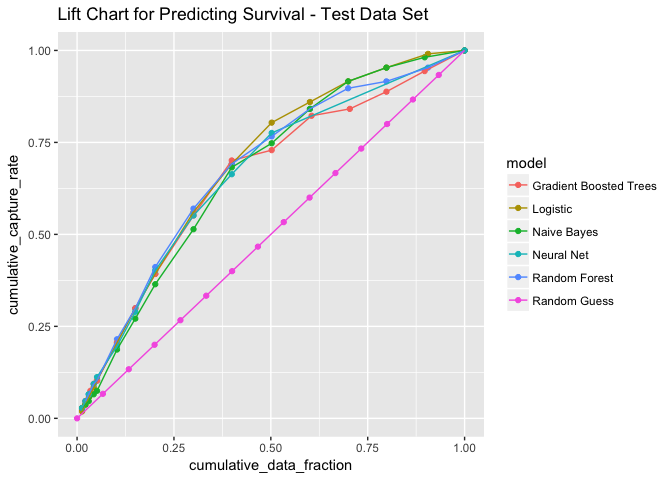
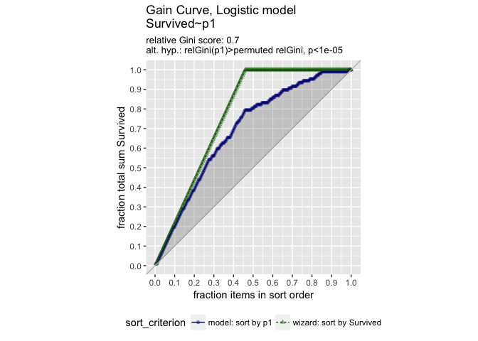
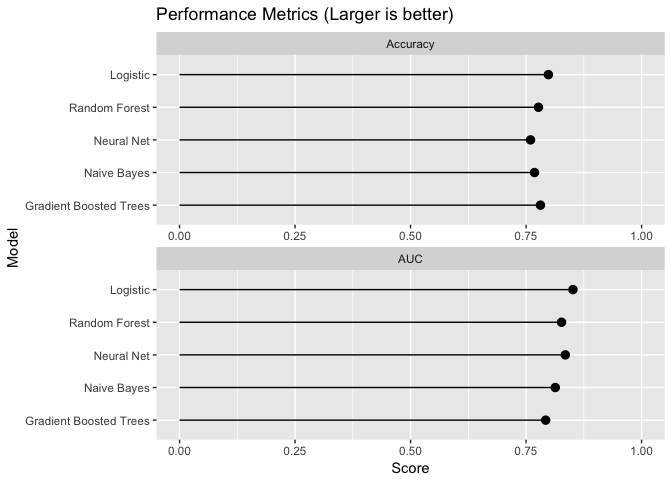
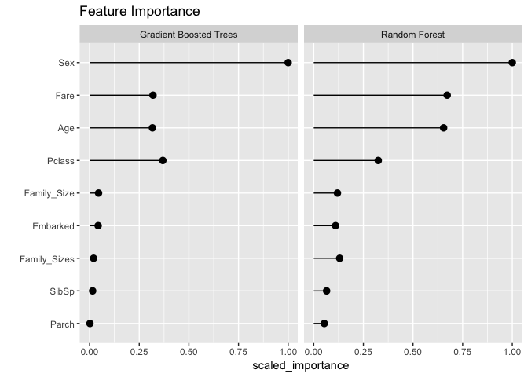

These are the class notes (Part 4 of 3) for *R for Big Data*, a workshop taught at *Strata + Hadoop World 2016 NYC*. The notes are saved as an R Markdown Notebook. See Part 1, *Universal Tools* to learn more about how to use R Markdown Notebooks.

Overview
========

Let's do the same analysis on the Titanic data, using h2o. The work pattern is to load the data into Spark, do some data transformations there, and then do the machine learning in h2o.

Load the data
=============

Load the Titanic Parquet data into a local spark cluster.

``` r
# Connect to local spark cluster and load data
sc <- spark_connect(master = "local", version = "2.0.0")
spark_read_parquet(sc, name = "titanic", path = "datainputs/titanic-parquet")
```

    ## Source:   query [891 x 12]
    ## Database: spark connection master=local[4] app=sparklyr local=TRUE
    ## 
    ##    PassengerId Survived Pclass
    ##          <int>    <int>  <int>
    ## 1            1        0      3
    ## 2            2        1      1
    ## 3            3        1      3
    ## 4            4        1      1
    ## 5            5        0      3
    ## 6            6        0      3
    ## 7            7        0      1
    ## 8            8        0      3
    ## 9            9        1      3
    ## 10          10        1      2
    ## # ... with 881 more rows, and 9 more variables: Name <chr>, Sex <chr>,
    ## #   Age <dbl>, SibSp <int>, Parch <int>, Ticket <chr>, Fare <dbl>,
    ## #   Cabin <chr>, Embarked <chr>

``` r
titanic_tbl <- tbl(sc, "titanic")
```

------------------------------------------------------------------------

Tidy the data
=============

Tidy the data in preparation for model fitting.

Spark SQL transforms
--------------------

Use feature transforms with Spark SQL. Create new features and modify existing features with `dplyr` syntax.

1.  Family\_Size - Create number of siblings and parents
2.  Pclass - Format passenger class as character not numeric
3.  Embarked - Remove a small number of missing records
4.  Age - Impute missing age with average age

``` r
# Transform features with Spark SQL API
titanic2_tbl <- titanic_tbl %>% 
  mutate(Family_Size = SibSp + Parch + 1L) %>% 
  mutate(Pclass = as.character(Pclass)) %>%
  filter(!is.na(Embarked)) %>%
  mutate(Age = if_else(is.na(Age), mean(Age), Age)) %>%
  sdf_register("titanic2")
```

> Tip: `sdf_register` is used to save our table for later analysis. This allows direct SQL on the table, which requires a name. <http://stackoverflow.com/questions/30926785/spark-dataframes-registertemptable-vs-not>.

Spark ML transforms
-------------------

Use feature transforms with Spark ML. Use `ft_bucketizer` to bucket family sizes into groups.

``` r
# Transform family size with Spark ML API
titanic_final_tbl <- titanic2_tbl %>%
  mutate(Family_Size = as.numeric(Family_size)) %>%
  sdf_mutate(
    Family_Sizes = ft_bucketizer(Family_Size, splits = c(1,2,5,12))
    ) %>%
  mutate(Family_Sizes = as.character(as.integer(Family_Sizes))) %>%
  compute()
```

Import data to H2O
------------------

Import the data from Spark to H2O for the machine learning.

``` r
# Make the h2o context available to spark
h2o_context(sc)
```

    ## <jobj[48]>
    ##   class org.apache.spark.h2o.H2OContext
    ##   
    ## Sparkling Water Context:
    ##  * H2O name: sparkling-water-johnmount_2083288225
    ##  * cluster size: 1
    ##  * list of used nodes:
    ##   (executorId, host, port)
    ##   ------------------------
    ##   (driver,127.0.0.1,54321)
    ##   ------------------------
    ## 
    ##   Open H2O Flow in browser: http://127.0.0.1:54321 (CMD + click in Mac OSX)
    ## 

``` r
titanic_h2o <- as_h2o_frame(sc, titanic_final_tbl) 
class(titanic_h2o)
```

    ## [1] "H2OFrame"

``` r
h2o.getId(titanic_h2o)
```

    ## [1] "frame_rdd_84_9bb718063b718fccc3ded4d5b7014c3e"

``` r
# see what we have
keys <- h2o.ls()
print(keys)
```

    ##                                             key
    ## 1 frame_rdd_84_9bb718063b718fccc3ded4d5b7014c3e

``` r
ref <- h2o.getFrame(as.character(keys[[1]]))
print(ref)
```

    ##   PassengerId Survived Pclass
    ## 1           1        0      3
    ## 2           2        1      1
    ## 3           3        1      3
    ## 4           4        1      1
    ## 5           5        0      3
    ## 6           6        0      3
    ##                                                  Name    Sex SibSp Parch
    ## 1                             Braund, Mr. Owen Harris   male     1     0
    ## 2 Cumings, Mrs. John Bradley (Florence Briggs Thayer) female     1     0
    ## 3                              Heikkinen, Miss. Laina female     0     0
    ## 4        Futrelle, Mrs. Jacques Heath (Lily May Peel) female     1     0
    ## 5                            Allen, Mr. William Henry   male     0     0
    ## 6                                    Moran, Mr. James   male     0     0
    ##             Ticket    Fare Cabin Embarked      Age Family_Size
    ## 1        A/5 21171  7.2500  <NA>        S 22.00000           2
    ## 2         PC 17599 71.2833   C85        C 38.00000           2
    ## 3 STON/O2. 3101282  7.9250  <NA>        S 26.00000           1
    ## 4           113803 53.1000  C123        S 35.00000           2
    ## 5           373450  8.0500  <NA>        S 35.00000           1
    ## 6           330877  8.4583  <NA>        Q 29.64209           1
    ##   Family_Sizes
    ## 1            1
    ## 2            1
    ## 3            0
    ## 4            1
    ## 5            0
    ## 6            0
    ## 
    ## [889 rows x 14 columns]

``` r
# can remove with : h2o.rm(as.character(keys[[1]]))
```

The equivalent of factor (categorical type) in h2o is the `enum`. Unlike R (and Spark ML), h2o does not automatically convert character vectors into enums before modeling. So we have to do it explicitly.

Some of the modeling methods insist on a enum type for the output, as well, when doing classification, so we must also convert the outcome to enum.

``` r
# check for character vectors
ischar = is.character(titanic_h2o)  # this is h2o::is.character
cvars = colnames(titanic_h2o)[ischar] 
for(var in cvars) {
    titanic_h2o[[var]] = as.factor(titanic_h2o[[var]]) # this is h2o::is.factor
}

outcome= "Survived"
titanic_h2o[[outcome]] = as.factor(titanic_h2o[[outcome]])
```

Train-validation split
----------------------

Randomly partition the data into train and test sets.

``` r
# partition the data 75/25 (as we did in the SparkML exercise)
partition = h2o.splitFrame(titanic_h2o, ratios=0.75, seed=8585)

# table references
training = partition[[1]]
test = partition[[2]]

nrow(training)
```

    ## [1] 656

``` r
nrow(test)
```

    ## [1] 233

------------------------------------------------------------------------

Machine Learning in H2O
-----------------------

Compare the following 5 models. Note that H2O does not have a vanilla decision tree algorithm

-   Random forest - `h2o.randomForest`
-   Gradient boosted trees - `h2o.gbm`
-   Logistic regression - `h2o.glm`
-   Deep neural network - `h2o.deeplearning`
-   Naive Bayes - `h2o.naiveBayes`

Train the models
================

Train multiple machine learning algorithms on the training data. Score the test data with the fitted models.

Logistic regression
-------------------

Logistic regression is one of the most common classifiers. Train the logistic regression and examine the predictors.

``` r
# Model survival as a function of several predictors
outcome = "Survived"
xvars = setdiff(colnames(training), c(outcome, "Name", "PassengerId", "Ticket", "Cabin"))
xvars
```

    ## [1] "Pclass"       "Sex"          "SibSp"        "Parch"       
    ## [5] "Fare"         "Embarked"     "Age"          "Family_Size" 
    ## [9] "Family_Sizes"

``` r
# Train a logistic regression model
ml_log <- h2o.glm(x = xvars, 
                  y = outcome, 
                  training_frame = training,
                  family="binomial",
                  lambda_search = TRUE)
```

    ## 
      |                                                                       
      |                                                                 |   0%
      |                                                                       
      |========                                                         |  13%
      |                                                                       
      |=================================================================| 100%

Other ML algorithms
-------------------

Model with the same variables using the other machine learning algorithms. Note that we are using the default settings for various parameters, which are not necessarily *good* settings.

``` r
## Random Forest 
ml_rf <- h2o.randomForest(x = xvars, 
                          y = outcome, 
                          training_frame = training)
```

    ## 
      |                                                                       
      |                                                                 |   0%
      |                                                                       
      |================================================                 |  74%
      |                                                                       
      |=================================================================| 100%

``` r
# additional parameters of interest: ntrees (default 50); max_depth (default 5)

## Gradient Boosted Tree
ml_gbt <- h2o.gbm(x = xvars, 
                  y = outcome, 
                  training_frame = training,
                  distribution="bernoulli")  
```

    ## 
      |                                                                       
      |                                                                 |   0%
      |                                                                       
      |=================================================================| 100%

``` r
# additional parameters of interest: ntrees (default 50); max_depth (default 5)

## Naive Bayes
ml_nb <- h2o.naiveBayes(x = xvars, 
                        y = outcome, 
                        training_frame = training,
                        laplace=0.001) # use laplace smoothing (default=0 : no smoothing)
```

    ## 
      |                                                                       
      |                                                                 |   0%
      |                                                                       
      |=================================================================| 100%

``` r
## Neural Network
ml_nn <- h2o.deeplearning(x = xvars, 
                          y = outcome, 
                          training_frame = training,
                          distribution="bernoulli",
                          hidden = c(11,15,2))
```

    ## 
      |                                                                       
      |                                                                 |   0%
      |                                                                       
      |=================================================================| 100%

Validation data
---------------

Score the test data with the trained models.

``` r
# Bundle the modelss into a single list object
ml_models <- list(
  "Logistic" = ml_log,
  "Random Forest" = ml_rf,
  "Gradient Boosted Trees" = ml_gbt,
  "Naive Bayes" = ml_nb,
  "Neural Net" = ml_nn
)

# Create a function for scoring
score_test_data <- function(model, data=test){
  # class prediction (predict), probability of class 0 (p0) probability of class 1 (p1)
  pred <- h2o.predict(model, data)
  # append the column of true outcomes
  h2o.cbind(data[["Survived"]], pred)
}

# Score all the models  - a list of references to h2o results
ml_score <- lapply(ml_models, score_test_data)
```

    ## 
      |                                                                       
      |                                                                 |   0%
      |                                                                       
      |=================================================================| 100%
    ## 
      |                                                                       
      |                                                                 |   0%
      |                                                                       
      |=================================================================| 100%
    ## 
      |                                                                       
      |                                                                 |   0%
      |                                                                       
      |=================================================================| 100%
    ## 
      |                                                                       
      |                                                                 |   0%
      |                                                                       
      |=================================================================| 100%
    ## 
      |                                                                       
      |                                                                 |   0%
      |                                                                       
      |=================================================================| 100%

------------------------------------------------------------------------

Compare results
===============

Compare the model results. Examine performance metrics: lift, AUC, and accuracy. Also examine feature importance to see what features are most predictive of survival.

Model lift
----------

The information to plot the gain curve come from the results of `h2o.gainsLift`, so we don't have to implement the calculation by hand as we did in the previous exercise.

``` r
# Apply model <modelname> to test data (by default) and calculate the lift. 
# Append a columne with the model name (for downstream plotting)
getLiftFrame = function(modelname, data=test) {
  cbind(h2o.gainsLift(ml_models[[modelname]], data), 
        model=modelname,
        stringsAsFactors=FALSE)
}

# calculate the gainsLift results
gainsLift = bind_rows(lapply(names(ml_models), getLiftFrame))

nbins=16
# add the random guessing performance benchmark
gainsLift = bind_rows(data.frame(cumulative_data_fraction = seq(0,1,len=nbins),
                       cumulative_capture_rate=seq(0,1,len=nbins),
                       model="Random Guess", stringsAsFactors=FALSE),
                      gainsLift)

# Plot results
ggplot(gainsLift, aes(x = cumulative_data_fraction, y = cumulative_capture_rate, colour = model)) +
  geom_point() + geom_line() +
  ggtitle("Lift Chart for Predicting Survival - Test Data Set")
```



Just for fun, let's redo the curve for logistic regression using WVPlots.

``` r
# create a vector of uniform random variates the same length as the data
selection = h2o.runif(ml_score[["Logistic"]])

# bring a "subset" of the results from the logistic model to local R
# again, for true large data you would use fraction < 1
fraction = 1 
ml_logistic = as.data.frame(ml_score[["Logistic"]][selection <= fraction,])

# note Survived and Predict are factors. We need to convert to 0/1
str(ml_logistic)
```

    ## 'data.frame':    233 obs. of  4 variables:
    ##  $ Survived: Factor w/ 2 levels "0","1": 1 2 1 2 1 2 2 2 1 1 ...
    ##  $ predict : Factor w/ 2 levels "0","1": 1 2 1 2 1 1 2 1 1 1 ...
    ##  $ p0      : num  0.911 0.0788 0.7628 0.1861 0.9713 ...
    ##  $ p1      : num  0.089 0.9212 0.2372 0.8139 0.0287 ...

``` r
ml_logistic$Survived = as.numeric(as.character(ml_logistic$Survived))
GainCurvePlot(ml_logistic, "p1", "Survived", "Gain Curve, Logistic model")
```



AUC and accuracy
----------------

H2O provides a variety of performance metrics via the function `h2o.performance`. Here, we look at Area Under the ROC curve (AUC), and accuracy. The higher the AUC the better.

The class prediction is based on whether Prob("Survived") &gt; Prob("Not Survived"), rather than on whether Prob("Survived") &gt; threshold. (The two are equivalent for threshold = 0.5, of course).

``` r
# Function for calculating accuracy
# scoreframe is a frame calculated by the function
# score_test_data, above
calc_accuracy <- function(scoreframe){
  sum(scoreframe[["Survived"]]==scoreframe[["predict"]])/nrow(scoreframe)
}

calc_auc = function(model, data=test) {
  h2o.auc(h2o.performance(model, newdata=test))
}

# Calculate AUC and accuracy
perf_metrics <- data.frame(
  model = names(ml_score),
  AUC = sapply(ml_models, calc_auc),
  Accuracy = sapply(ml_score, calc_accuracy),
  row.names = NULL, stringsAsFactors = FALSE)

# Plot results
gather(perf_metrics, metric, value, AUC, Accuracy) %>%
  ggplot(aes(reorder(model, value, FUN=mean), value)) + 
  geom_pointrange(aes(ymin=0, ymax=value)) + 
  facet_wrap(~metric, ncol=1, scale="free_x") + 
  xlab("Model") +
  ylab("Score") +
  ggtitle("Performance Metrics (Larger is better)")  +
  coord_flip(ylim=c(0,1))
```



Feature importance
------------------

It is also interesting to compare the features that were identified by each model as being important predictors for survival. We can somewhat do this with the function `h2o.varimp`, which gives different style of output for different models, and does not calculate variable importances for some model types. We can compare the variable importances from tree-based models, which return the same variable importance metrics.

``` r
# Initialize results
feature_importance <- data.frame()

# Calculate feature importance
for(i in c("Random Forest", "Gradient Boosted Trees")){
  feature_importance <- h2o.varimp(ml_models[[i]]) %>%
    mutate(Model = i) %>%
    select(Model, variable, scaled_importance) %>%
    rbind(feature_importance, .)
}

# Plot results
feature_importance %>%
  ggplot(aes(reorder(variable, scaled_importance), scaled_importance)) + 
  facet_wrap(~Model) +
  geom_pointrange(aes(ymin=0, ymax=scaled_importance)) + 
  coord_flip() +
  xlab("") +
  ggtitle("Feature Importance")
```


